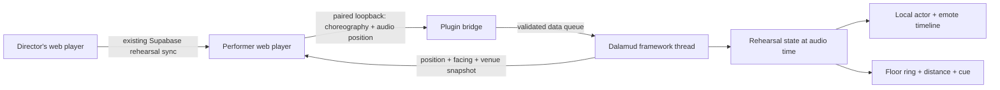

# Implementation notes



## Coordinate ownership

The web slide remains the choreography source. Its existing `x`/`y` fields
are SVG coordinates in the 1200×700 canvas. The added optional actor data is:

```json
{ "game": { "height": 1.2, "heading": 90, "emote": "beesknees" } }
```

`stage_data.game_venue` stores the calibration. If several slides carry a
calibration, the newest revision wins for that song. Duplicating a slide
preserves metadata; deleting a slide carries the current calibration onto a
remaining slide. Deleting every slide deletes its calibration too, so export
one for reuse. These fields use the existing JSONB column and RLS.

Three non-collinear points define an affine transform from map `(u,v)` to
game `(X,Z)`. The inverse records real marks back into the editor. Facing is
transformed as a direction vector. Height is independent: first anchor Y
plus actor height. Both map and world triangles are checked for degeneracy.
The UI asks that all anchors be on the same floor.

The plugin consumes **resolved world positions**, not an independent second
calibration implementation. This avoids JS/C# disagreements about the transform.

## Cue semantics

At any playback time, the engine computes the active slide and latest
applicable action for each cast member. A preview cue replaces that actor's
target with the upcoming slide's position until its timestamp is reached.
Preview ghosts are idle. Actions carry stable keys so a heartbeat does not
restart an emote. Seeking recomputes state rather than replaying every missed
cue. The selected ghost represents either the current mark or the next mark,
not both simultaneously.

Slashes are parsed into reminders. No lyric text becomes an executed game
chat command. Emote names must resolve through the game's Emote/TextCommand
sheet before the local ghost receives an action timeline.

## Thread and object lifetime

All game-object reads, housing reads, appearance copies, actor creation,
timeline changes, and deletion happen on `Framework.Update`, including UI
requests that enter its action queue. Socket workers handle managed JSON only.
The browser gets an immutable position snapshot from the last framework tick.

The adapter owns only the actor slots it allocated and checks their pointer
identity before use or removal. Readiness has a five-second timeout; failed
spawns are deleted. Zoning forgets handles from the old game object pool and
disarms rendering. Unload cancels the bridge and awaits framework-thread
native cleanup through `IAsyncDalamudPlugin`.

Native handles are isolated in `NativeGhosts.cs`. No copied signature bytes,
manual VFX struct layouts, game-resource replacement, or remote arbitrary
native calls are part of the protocol.

## Local connection

- TCP listener binds **127.0.0.1:17845**, with no Windows HTTP.sys URL ACL.
- Only `POST /snapshot`, `POST /state`, and their CORS preflight are exposed.
- Both exact configured Origin and a random 192-bit bearer token are required.
  Token is not put in the URL, logged, or persisted by the browser.
- Host header must match loopback; credentials and cookies are not sent.
- Maximum header 8 KiB, body 4 MiB, four concurrent connections, five-second
  socket deadline, eight pending framework requests, 2.5-second queued-state
  expiry, and three-second playback timeout.
- Session IDs and increasing sequence numbers discard repeated/out-of-order
  packets. A new browser session must include choreography.
- Calibration export contains venue and coordinates only. Choreography export
  contains cast names/worlds, resolved marks and cue commands; it omits account
  credentials, image assets, audio files, and full lyrics.

The browser connection is optional. It is not a separate authority over
rehearsal membership: your current browser authentication and conductor logic
continue to apply. This prototype does not replace or strengthen the existing
Supabase room's permission model.

## Verification record (2026-09-25)

- Release build: .NET SDK 10.0.401; official Dalamud SDK 15.0.0; zero warnings/errors.
- Seven Node tests covering calibration, inverse recording, height/facing,
  degenerate data, actor-targeted cues, duplicate positions and ordering.
- Twenty C# core checks consuming a real JavaScript-exported fixture.
- Six loopback HTTP checks covering token/origin rejection, CORS, malformed
  input and real JSON round trips.
- Headless Chrome exercised the installed web modules with the real stage
  renderer: pairing, capture of three anchors, height/emote save, reverse
  position capture, export, slide switching, and actual app startup with a
  stubbed logged-out session; no page errors.
- Windows game runtime, real multi-PC synchronization, live account/DB writes,
  and native model appearance/animation remain untested. Hosted-site deployment
  was subsequently verified; see `DEPLOYMENT.md`.

Reference binary SHA-256 (official `dalamud-distrib/stg/latest.zip`, fetched on
2026-09-25):

```text
Dalamud.dll
d80ec5195d4e6d497219b93b0f75a033902053b2041395b4ad666e5878d71658
FFXIVClientStructs.dll
ad1504ce424355b29bb34d7974725e447a77df2548b9b83575afd10ac4a755a7
```

## Custom repository release (2026-09-26)

Version 0.1.1 was rebuilt against official stable `dalamud-distrib/latest.zip`
(Dalamud 15.0.3.5), with zero warnings or errors. All seven Node tests and
26 C# core/loopback checks passed again. `tools/prepare-release.py` checks the
built manifest, ZIP contents and integrity, and creates a SHA-256 checksum
and staged repository feed. In-game native ghost validation remains pending.

## Ghost movement correction (0.1.2)

The first in-game report found ghosts remaining on their original marks across
slide changes. The native adapter had assigned `Position` and `Rotation`
fields directly. It now calls the game's `SetPosition` and `SetRotation`
functions, exposed by FFXIVClientStructs, so a loaded model is notified of its
new transform. This happens before the unchanged-action early return: editing
a position within the same slide must not depend on restarting the emote.

The release build against the same stable API 15 references has zero warnings
or errors. Seven added checks cover positions at a browser-driven slide
boundary, the director's cast, subsequent heartbeats, live edits with unchanged
actions, rewinds, and `/nextpos` previews. All 40 Node/core/loopback checks pass.
These exercise the targets supplied to the adapter; they cannot verify native
draw-object behavior outside FFXIV. In-game confirmation of this correction
remains pending. The web protocol and saved calibration format are unchanged.

## Rehearsal feedback and controls (0.1.3)

Readiness is evaluated per cast ID from the assigned real player, with each
remote performer resolved by character name and home world. Missing players
produce an unavailable state. The selected local role uses the local player.
The observer reads the real player's `EmoteController.EmoteId` on the framework
thread and compares it with the command's Emote sheet row. It never executes
an emote on a player or uses a ghost's animation to claim readiness.

`ReadinessTracker` owns managed cue completion. It checks horizontal distance
and height before accepting a due emote, retains completion for short gestures,
and resets for a new cue, edited position, leaving the mark, or new playback
epoch. Paused and preview targets cannot complete an emote. Unknown commands
stay pending; unsupported or mod-specific emotes need in-game validation.

Ghost animation keys include playback state/epoch. Pausing resets the owned
ghost's overrides and timeline slots to idle. Resuming applies the current cue
again. Upcoming emotes are indexed when choreography changes, combining slide
actions and timed cues with last-cue-wins behavior at tied timestamps. The
world labels and selected-performer HUD use the same browser clock.

The window now groups Rehearsal, Connection, and Display & sound controls.
Choreography file import and local playback controls are removed. The internal
load/seek functions remain for deterministic engine tests. Return to current
position suppresses preview until the current slide ends; music keeps playing.

Verification: release builds without warnings; seven Node checks plus 65 C#
core/bridge checks pass. Browser regression covers pairing, calibration, actor
cue editing, position capture, backup export, slide switching and app startup.
The native idle transition, live emote observation, and ImGui layout still
require validation in Windows FFXIV.
